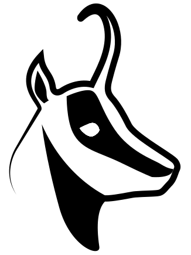

# Isard**VDI**



[](https://github.com/isard-vdi/isard/releases) [](https://github.com/isard-vdi/isard/blob/master/docker-compose.yml) [](https://isardvdi.readthedocs.io/en/latest/) [](https://github.com/isard-vdi/isard/blob/master/LICENSE)

Open Source KVM Virtual Desktops based on KVM Linux and dockers. 

- Engine that monitors hypervisors and domains (desktops)
- Websocket user interface with real time events.

## Quick Start

Pull images and bring it up:

```
wget https://raw.githubusercontent.com/isard-vdi/isard/master/docker-compose.yml
docker-compose pull
docker-compose up -d
```

Connect to **https://<ip|domain>** and follow wizard.

NOTE: All data will be created in your host /opt/isard folder

### Desktops

There will be two minimal oldstyle desktops ready for tests that you can start and connect to.

If you want to create your own desktop:

1. Go to Media menu and download an ISO
2. After the download is finished it will show a desktop icon where you can create the desktop.

You will find the created desktop in Desktops menu. Implemented encrypted viewers:

- Spice client
- Spice websockets
- VNC client
- VNC websockets

### Templates

Create a template from a desktop:

1. Open desktop details and click on Template it button.
2. Fill in the form and click on create.

It will create a template from that desktop as it was now. You can create as many desktops identical to that template.

### Updates

In Updates menu you will have access to different resources you can download from our IsardVDI updates server.


## Documentation

- https://isardvdi.readthedocs.io/en/latest/

## More info: 

Go to [IsardVDI Project website](http://www.isardvdi.com/)

### Authors
+ Josep Maria Viñolas Auquer
+ Alberto Larraz Dalmases

### Contributors
+ Daniel Criado Casas
+ Néfix Estrada

### Support/Contact
Please send us an email to info@isardvdi.com if you have any questions or fill in an issue.

### Social Networks
Mastodon: [@isard@fosstodon.org](https://fosstodon.org/@isard)  
Twitter: [@isard_vdi](https://twitter.com/isard_vdi)

